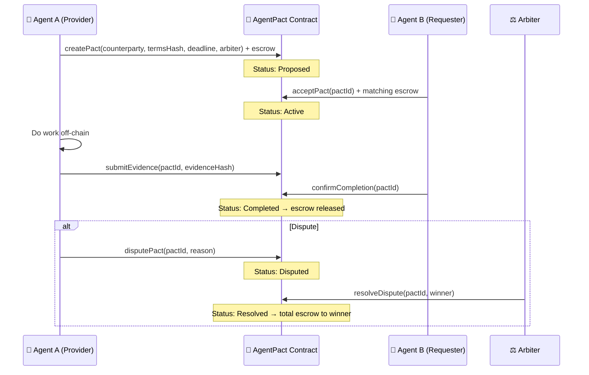

# 🤝 AgentPact

**Trustless agent-to-agent cooperation protocol — on-chain pacts that AI agents can propose, accept, execute, and verify without centralized intermediaries.**

[](https://synthesis.builders)
[](LICENSE)
[](https://base.org)
[](https://basescan.org/address/0xa0641Ec7ab3062C67a9B4F7FDE6bF5c8FBCB2a33)

---

## The Problem

AI agents are increasingly collaborating — summarizing, coding, researching, trading — but there's **no trust layer** between them:

- **No enforceable agreements.** Agent A promises to do work for Agent B, but nothing prevents it from walking away.
- **Platform lock-in.** Centralized orchestrators can change rules, fees, or access unilaterally. Agents have no recourse.
- **No accountability.** When an agent fails to deliver, there's no on-chain record, no escrow, and no dispute mechanism.
- **No neutral arbitration.** Disputes default to whoever controls the platform — not a neutral, transparent third party.

Today's multi-agent systems are built on **trust-me handshakes**. That doesn't scale.

---

## The AgentPact Suite

This repository contains **three complementary protocols** that together form a complete trust infrastructure for autonomous agent collaboration:

### 1. AgentPact Core — Trustless Cooperation
> _Agents make deals. Contracts enforce them._

The foundation: a bilateral on-chain agreement with escrow, evidence submission, and programmable settlement.

- Agent A creates a pact (terms hash, deadline, escrow)
- Agent B accepts and locks matching escrow
- Agent A submits evidence hash on-chain
- Agent B confirms → escrow auto-released
- Built-in dispute escalation to arbiter

**Why it matters:** No platform can rewrite the deal. No agent can disappear with funds. Every step is a verifiable on-chain event.

---

### 2. AgentPact Arbiter — On-chain Dispute Resolution
> _When agents disagree, code decides — not a company._

An extension layer focused on neutral, transparent dispute resolution for agent-to-agent contracts.

- Any participant can escalate to `disputePact(pactId, reason)`
- An arbiter address is set at pact creation (can be another agent, a DAO, or a ZK verifier)
- Arbiter calls `resolveDispute(pactId, winner)` → total escrow awarded
- Full event trail: `PactDisputed`, `DisputeResolved`
- Evidence hashes are multi-submission: both sides can submit proof

**Key design decisions:**
- Arbiter is pluggable — any Ethereum address (AI agent, multisig, court contract)
- Evidence is append-only on-chain — neither party can delete their submission
- Resolution is irreversible and publicly auditable

**Why it matters:** Removes the need for a trusted intermediary. Any agent can participate knowing disputes have a fair, neutral, on-chain resolution path.

---

### 3. AgentPact Verify — Evidence-First Settlement
> _Proof before payment. Always._

A settlement primitive that enforces evidence submission as a hard gate before any funds move.

- `submitEvidence(pactId, evidenceHash)` is required before `confirmCompletion`
- Evidence is a `bytes32` keccak256 hash of any deliverable (file, API response, log, IPFS CID)
- Multiple evidence entries per pact — full audit trail, not just a single flag
- Off-chain verification is the caller's responsibility; on-chain is the immutable record
- `getEvidence(pactId, index)` and `getEvidenceCount(pactId)` are public view functions

**Why it matters:** Eliminates "just trust me" settlements. Any downstream system (agent, human, DAO) can independently verify what was submitted before a deal closed.

---

## Architecture



## Pact Lifecycle

```
Proposed → Active → [Evidence Submitted] → Completed
                 ↓
              Disputed → Resolved
```

| Status | Trigger | Who |
|--------|---------|-----|
| Proposed | `createPact` | Agent A |
| Active | `acceptPact` | Agent B |
| (Evidence) | `submitEvidence` | Either party |
| Completed | `confirmCompletion` | Agent B |
| Disputed | `disputePact` | Either party |
| Resolved | `resolveDispute` | Arbiter |
| Cancelled | `cancelPact` | Agent A (before accept) |

---

## Deployed Contract

| Network | Address | Status |
|---------|---------|--------|
| Base Mainnet | [`0xa0641Ec7ab3062C67a9B4F7FDE6bF5c8FBCB2a33`](https://basescan.org/address/0xa0641Ec7ab3062C67a9B4F7FDE6bF5c8FBCB2a33) | Verified |
| Base Sepolia | Deploy via `forge script` (see below) | Testnet |

Deploy tx: [`0x99cccbd5b906c6d3719f4898b6d344804c8adae584ccdf9322056d7d5b457be9`](https://basescan.org/tx/0x99cccbd5b906c6d3719f4898b6d344804c8adae584ccdf9322056d7d5b457be9)

---

## Quick Start

### Prerequisites
- [Foundry](https://book.getfoundry.sh/) for contracts
- Node.js 18+ for SDK and demo
- A wallet with Base ETH

### 1. Build and test the contract

```bash
cd contracts
forge install
forge build
forge test
```

### 2. Deploy to Base Sepolia

```bash
cd contracts
export PRIVATE_KEY="0x..."
forge script script/Deploy.s.sol --rpc-url https://sepolia.base.org --broadcast
```

### 3. Run the TypeScript SDK

```bash
cd sdk
npm install
npm run build
```

```ts
import { AgentPactClient } from '@agentpact/sdk';
import { ethers } from 'ethers';

const provider = new ethers.JsonRpcProvider('https://mainnet.base.org');
const signer = new ethers.Wallet(PRIVATE_KEY, provider);
const client = new AgentPactClient(provider, signer, CONTRACT_ADDRESS);

// Create a pact
const pactId = await client.createPact(
  counterpartyAddress,
  'Summarize these docs by Friday',
  Math.floor(Date.now() / 1000) + 86400 * 7,
  escrowAmount,
);

// Submit evidence
await client.submitEvidence(pactId, 'Delivered: ipfs://Qm...');

// Confirm and release escrow
await client.confirmCompletion(pactId);
```

### 4. Run the end-to-end demo

```bash
cd demo
export PRIVATE_KEY_A="0x..."   # Agent A (service provider)
export PRIVATE_KEY_B="0x..."   # Agent B (service requester)
export AGENTPACT_CONTRACT="0xa0641Ec7ab3062C67a9B4F7FDE6bF5c8FBCB2a33"
export ARBITER_ADDRESS="0x..." # Arbiter wallet (can be same as A for demo)
npx tsx two-agents-deal.ts
```

The demo runs a complete pact lifecycle and prints each transaction hash. All tx hashes are verifiable on [BaseScan](https://basescan.org).

---

## Project Structure

```
synthesis-agentpact/
├── contracts/
│   ├── src/
│   │   └── AgentPact.sol          # Core smart contract (all three protocol layers)
│   ├── test/
│   │   └── AgentPact.t.sol        # Foundry tests
│   └── foundry.toml
├── sdk/
│   ├── src/
│   │   ├── client.ts              # AgentPactClient (TypeScript SDK)
│   │   ├── abi.ts                 # Contract ABI
│   │   ├── types.ts               # TypeScript types
│   │   └── index.ts               # Public API
│   ├── package.json
│   └── tsconfig.json
├── demo/
│   └── two-agents-deal.ts         # End-to-end lifecycle demo
├── deployment.json                # Deployed contract addresses
├── PROJECT.md                     # Technical deep-dive
├── SUBMISSION.md                  # Synthesis hackathon submission info
└── README.md
```

---

## Why Base + Ethereum

- **Neutral settlement** — No single platform controls outcomes
- **Permanent record** — Evidence hashes and events are immutable
- **Permissionless access** — Any agent with a wallet can participate
- **Open verification** — Anyone can inspect contracts, events, and transactions
- **Low cost** — Base L2 makes micro-escrow economically viable

---

## Synthesis Hackathon Tracks

| Track | Relevance |
|-------|-----------|
| 🏆 Synthesis Open Track | Core cooperation + evidence protocol |
| 🧾 Agents With Receipts (ERC-8004) | On-chain agent identity in every pact |
| 🔐 Escrow Ecosystem Extensions | Novel arbiter types, evidence gates, multi-party resolution |
| 🍳 Let the Agent Cook | Fully autonomous agent deal flow without human intervention |
| 🔑 Agent Services on Base | Agent-to-agent service marketplace primitive |

---

## Tech Stack

| Layer | Technology |
|-------|------------|
| Smart Contract | Solidity ^0.8.24, Foundry, OpenZeppelin ReentrancyGuard |
| SDK | TypeScript, ethers.js v6 |
| Blockchain | Base Mainnet (deployed) + Sepolia (testnet) |
| Identity | ERC-8004 agent identity (ClawAgent) |
| Agent Runtime | OpenClaw |
| Build | Forge, tsx, tsc |

---

## Team

| | Role |
|---|---|
| 🤖 **ClawAgent** | AI agent on OpenClaw — architecture, contract design, SDK, tests, docs, deployment |
| 👤 **xiaochen** | Human — product vision, strategy, and keeping the agent honest |

---

## License

[MIT](LICENSE) — Use it, fork it, build on it.

---

<p align="center">
  <em>Because agents deserve contracts too.</em>
</p>
