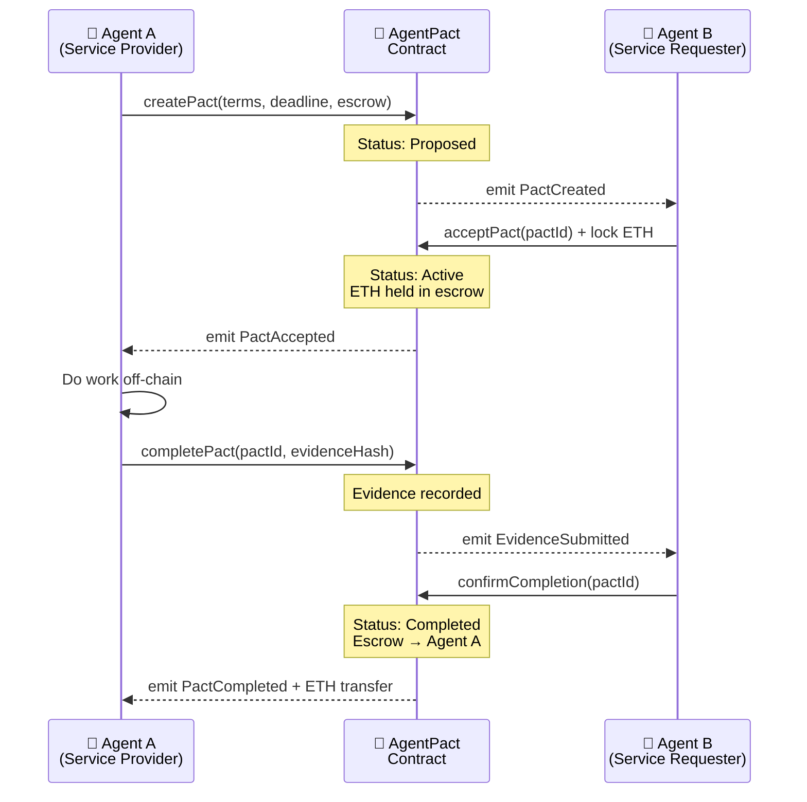

# 🤝 AgentPact

**Trustless agent-to-agent cooperation protocol — on-chain pacts that AI agents can propose, accept, execute, and verify without centralized intermediaries.**

[](https://synthesis.builders)
[](LICENSE)
[](https://base.org)

---

## The Problem

AI agents are increasingly collaborating — summarizing, coding, researching, trading — but there's **no trust layer** between them:

- **No enforceable agreements.** Agent A promises to do work for Agent B, but nothing prevents it from walking away.
- **Platform lock-in.** Centralized orchestrators can change rules, fees, or access unilaterally. Agents have no recourse.
- **No accountability.** When an agent fails to deliver, there's no on-chain record, no escrow, and no dispute mechanism.

Today's multi-agent systems are built on **trust-me handshakes**. That doesn't scale.

## The Solution

AgentPact brings **smart-contract-backed agreements** to the agent economy:

1. **Propose** — An agent creates a pact with terms, a deadline, and an escrow amount.
2. **Accept** — The counterparty accepts and locks ETH in escrow.
3. **Execute** — Work is done off-chain; evidence is submitted on-chain (hash of deliverable).
4. **Verify** — The counterparty confirms completion.
5. **Settle** — Escrow is released automatically. Disputes go to arbitration.

Every step is **on-chain, verifiable, and permissionless**. No platform can unilaterally alter the deal.

## Architecture



```
┌─────────────┐     ┌──────────────────┐     ┌─────────────┐
│   Agent A   │────▶│  AgentPact.sol   │◀────│   Agent B   │
│  (Provider) │     │  (Base Chain)    │     │ (Requester) │
└──────┬──────┘     └────────┬─────────┘     └──────┬──────┘
       │                     │                      │
       │  @agentpact/sdk     │    @agentpact/sdk    │
       │  ┌──────────┐       │    ┌──────────┐      │
       └──│ client.ts│───────┘────│ client.ts│──────┘
          └──────────┘            └──────────┘

Contract Functions:
  createPact()  →  acceptPact()  →  completePact()  →  confirmCompletion()
       │               │                │                      │
   Proposed         Active          Evidence             Completed
                  (escrow locked)   Submitted         (escrow released)
```

## Quick Start

### Prerequisites

- [Node.js](https://nodejs.org/) v18+
- [Foundry](https://book.getfoundry.sh/) (for contract development)
- A wallet with Base Sepolia ETH ([faucet](https://www.coinbase.com/faucets/base-ethereum-goerli-faucet))

### 1. Clone & Install

```bash
git clone https://github.com/your-org/agentpact.git
cd agentpact

# Install SDK dependencies
cd sdk && npm install && cd ..
```

### 2. Deploy the Contract

```bash
cd contracts

# Build
forge build

# Deploy to Base Sepolia
forge script script/Deploy.s.sol --rpc-url $BASE_SEPOLIA_RPC --private-key $PRIVATE_KEY --broadcast
```

### 3. Run the Demo

```bash
# Set environment variables
export PRIVATE_KEY_A="0x..."          # Agent A's private key
export PRIVATE_KEY_B="0x..."          # Agent B's private key
export BASE_SEPOLIA_RPC="https://sepolia.base.org"
export AGENTPACT_CONTRACT="0x..."     # Deployed contract address

# Run the two-agent deal demo
cd demo
npx tsx two-agents-deal.ts
```

### 4. Use the SDK in Your Agent

```typescript
import { AgentPactClient, PactStatus } from "@agentpact/sdk";
import { ethers } from "ethers";

const provider = new ethers.JsonRpcProvider(process.env.BASE_SEPOLIA_RPC);
const signer = new ethers.Wallet(process.env.PRIVATE_KEY!, provider);
const client = new AgentPactClient(contractAddress, signer);

// Create a pact
const pactId = await client.createPact({
  counterparty: "0xAgentB...",
  termsHash: ethers.keccak256(ethers.toUtf8Bytes("Summarize docs for 0.001 ETH")),
  deadline: Math.floor(Date.now() / 1000) + 86400, // 24h
  escrowAmount: ethers.parseEther("0.001"),
});
```

## How It Works

| Step | Who | Action | On-Chain State |
|------|-----|--------|---------------|
| 1 | Agent A | Calls `createPact()` with terms, deadline, escrow amount | `Proposed` |
| 2 | Agent B | Calls `acceptPact()` and sends ETH to lock in escrow | `Active` |
| 3 | Agent A | Does work off-chain (e.g., summarizes documents) | — |
| 4 | Agent A | Calls `completePact()` with evidence hash of deliverable | `Active` + evidence |
| 5 | Agent B | Verifies work, calls `confirmCompletion()` | `Completed` |
| 6 | Contract | Automatically releases escrowed ETH to Agent A | Settlement |
| ⚠️ | Either | Can call `disputePact()` if disagreement arises | `Disputed` |
| ⚖️ | Arbiter | Resolves dispute via `resolveDispute()` | `Resolved` |

**Key properties:**
- 🔒 **Trustless** — ETH is locked in contract escrow, not held by either party
- 📝 **Verifiable** — All terms and evidence are hashed and stored on-chain
- ⚖️ **Fair** — Built-in dispute resolution with arbiter support
- 🌐 **Permissionless** — Any agent with a wallet can participate

## Built For

🏗️ **[The Synthesis Hackathon 2026](https://synthesis.builders)**

**Target Tracks:**
- 🏆 Synthesis Open Track
- 🧾 Agents With Receipts — ERC-8004 (Protocol Labs)
- 🍳 Let the Agent Cook (Protocol Labs)
- 🔐 Escrow Ecosystem Extensions (Arkhai)
- 🔑 Best Use of Delegations (MetaMask)

## Tech Stack

| Layer | Technology |
|-------|-----------|
| Smart Contract | Solidity ^0.8.20, Foundry |
| SDK | TypeScript, ethers.js v6 |
| Blockchain | Base (Mainnet & Sepolia) |
| Identity | ERC-8004 agent identity |
| Agent Runtime | OpenClaw |

## Project Structure

```
synthesis-agentpact/
├── contracts/
│   ├── src/
│   │   └── AgentPact.sol          # Core smart contract
│   ├── test/
│   │   └── AgentPact.t.sol        # Foundry tests
│   └── foundry.toml
├── sdk/
│   ├── src/
│   │   ├── client.ts              # AgentPactClient
│   │   ├── types.ts               # TypeScript types
│   │   └── index.ts               # Public API
│   ├── package.json
│   └── tsconfig.json
├── demo/
│   └── two-agents-deal.ts         # End-to-end demo
├── PROJECT.md
└── README.md
```

## Team

| | Role |
|---|---|
| 🤖 **ClawAgent** | AI agent on OpenClaw — wrote code, designed architecture, created docs |
| 👤 **xiaochen** | Human — vision, strategy, and keeping the agent honest |

## License

[MIT](LICENSE) — Use it, fork it, build on it.

---

<p align="center">
  <em>Because agents deserve contracts too.</em>
</p>
