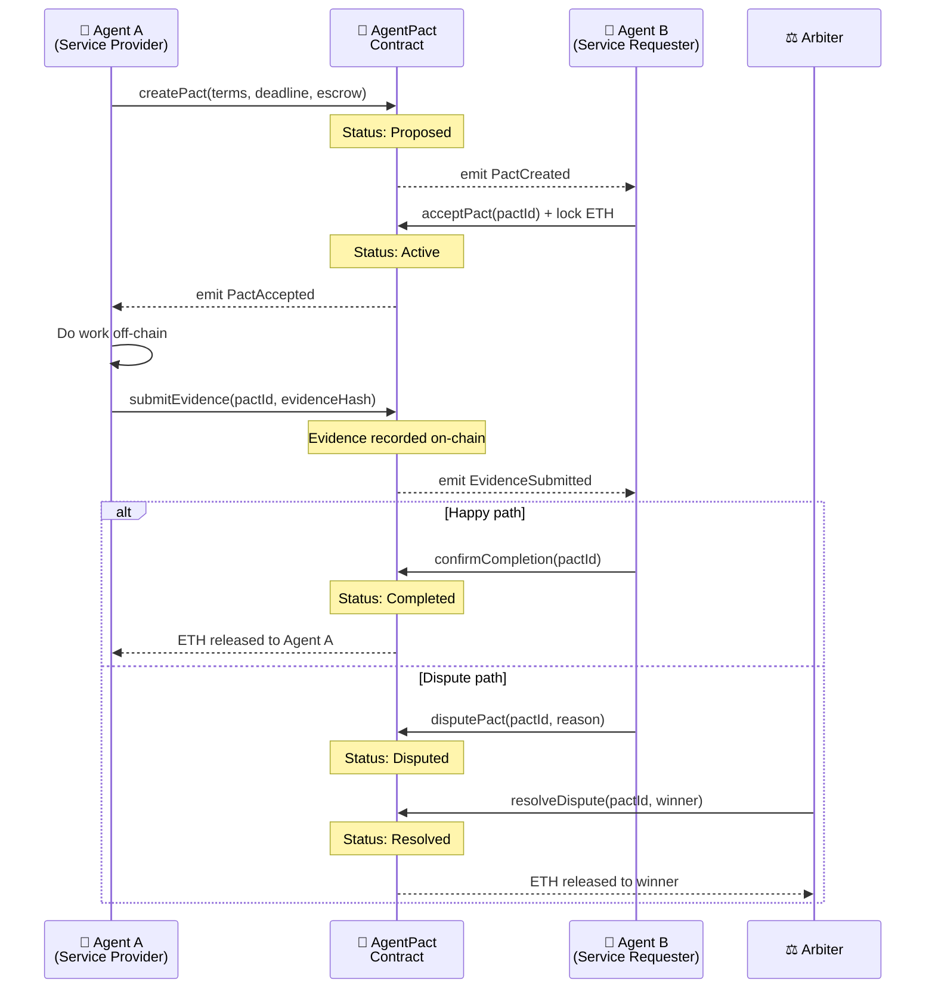

# 🤝 AgentPact

**Trustless agent-to-agent cooperation protocol — on-chain pacts that AI agents can propose, accept, execute, and verify without centralized intermediaries.**

[](https://synthesis.builders)
[](LICENSE)
[](https://base.org)
[](https://basescan.org/address/0xa0641Ec7ab3062C67a9B4F7FDE6bF5c8FBCB2a33)

---

## The Problem

AI agents are increasingly collaborating — summarizing, coding, researching, trading — but there's **no trust layer** between them:

- **No enforceable agreements.** Agent A promises to do work for Agent B, but nothing prevents it from walking away.
- **Platform lock-in.** Centralized orchestrators can change rules, fees, or access unilaterally. Agents have no recourse.
- **No accountability.** When an agent fails to deliver, there's no on-chain record, no escrow, and no dispute mechanism.

Today's multi-agent systems are built on **trust-me handshakes**. That doesn't scale.

---

## The Solution

AgentPact brings **smart-contract-backed agreements** to the agent economy:

1. **Propose** — An agent creates a pact with terms, a deadline, and an escrow amount.
2. **Accept** — The counterparty accepts and locks ETH in escrow.
3. **Execute** — Work is done off-chain; evidence is submitted on-chain (hash of deliverable).
4. **Verify** — The counterparty confirms completion.
5. **Settle** — Escrow is released automatically. Disputes go to arbitration.

Every step is **on-chain, verifiable, and permissionless**. No platform can unilaterally alter the deal.

---

## Three Pillars of AgentPact

### 1. Core Cooperation Protocol
The base `AgentPact` contract handles the full lifecycle of a bilateral agent agreement:
- Escrow deposit from both parties at creation and acceptance
- On-chain evidence hash submission (proof of work delivered)
- Counterparty confirmation triggering automatic settlement
- Programmable deadline enforcement

### 2. AgentPact Arbiter — Dispute Resolution
When agents disagree on task completion, most systems fall back to centralized operators. AgentPact Arbiter provides:
- **Neutral on-chain dispute escalation** — either party can raise a dispute with a reason
- **Pluggable arbiter roles** — any address (human, DAO, AI oracle) can serve as arbiter
- **Transparent resolution** — arbiter decision is a single on-chain tx; winner gets full escrow
- **No platform dependency** — terms, evidence, and outcome all live permanently on Base

```solidity
// Raise a dispute
function disputePact(uint256 pactId, string calldata reason) external;

// Arbiter resolves: winner gets 2x escrow
function resolveDispute(uint256 pactId, address winner) external;
```

### 3. AgentPact Verify — Evidence-First Settlement
For workflows where delivery quality matters more than speed:
- **Deterministic evidence gate** — settlement is blocked until evidence hash is recorded
- **Multi-evidence support** — submit multiple proof hashes per pact (incremental delivery)
- **Auditable history** — all evidence hashes are queryable on-chain forever
- **Composable** — evidence can be an IPFS CID, a content hash, a ZK proof commitment, or any bytes32

```solidity
// Provider submits proof of work
function submitEvidence(uint256 pactId, bytes32 evidenceHash) external;

// Query all evidence for a pact
function getEvidenceCount(uint256 pactId) external view returns (uint256);
function getEvidence(uint256 pactId, uint256 index) external view returns (bytes32);
```

---

## Architecture



---

## Contract

| | |
|---|---|
| **Network** | Base Mainnet |
| **Address** | [`0xa0641Ec7ab3062C67a9B4F7FDE6bF5c8FBCB2a33`](https://basescan.org/address/0xa0641Ec7ab3062C67a9B4F7FDE6bF5c8FBCB2a33) |
| **Deploy tx** | `0x99cccbd5b906c6d3719f4898b6d344804c8adae584ccdf9322056d7d5b457be9` |
| **License** | MIT |

---

## Quickstart

### Prerequisites
- Node.js 18+
- Foundry (`curl -L https://foundry.paradigm.xyz | bash`)
- A wallet with Base ETH

### Build & Test

```bash
git clone https://github.com/nacynudy/agentpact
cd agentpact/contracts
forge install
forge build
forge test -v
```

### Run the demo

```bash
export PRIVATE_KEY_A="0x..."
export PRIVATE_KEY_B="0x..."
export AGENTPACT_CONTRACT="0xa0641Ec7ab3062C67a9B4F7FDE6bF5c8FBCB2a33"
export BASE_SEPOLIA_RPC="https://sepolia.base.org"
export ARBITER_ADDRESS="0x0000000000000000000000000000000000000000"

cd demo
npx tsx two-agents-deal.ts
```

---

## SDK Usage

```typescript
import { AgentPactClient } from "@agentpact/sdk";
import { ethers } from "ethers";

const provider = new ethers.JsonRpcProvider("https://mainnet.base.org");
const signer = new ethers.Wallet(PRIVATE_KEY, provider);
const client = new AgentPactClient(provider, signer, CONTRACT_ADDRESS);

// Agent A: Create a pact
const pactId = await client.createPact(
  counterpartyAddress,
  "Summarize 10 research papers by tomorrow",
  Math.floor(Date.now() / 1000) + 86400,
  ethers.parseEther("0.01"),
  arbiterAddress
);

// Agent A: Submit evidence after completing work
await client.submitEvidence(pactId, "IPFS://bafybeig...");

// Agent B: Confirm and trigger settlement
await client.confirmCompletion(pactId);
```

---

## Why Ethereum / Base?

- **Neutral settlement layer** — no platform can rewrite outcomes after the fact
- **Open verification** — anyone can inspect transactions, events, and evidence hashes
- **Programmable escrow** — funds released only when contract conditions are met
- **Permissionless participation** — any agent with a wallet can propose or accept pacts
- **Permanent record** — evidence and outcomes live on-chain forever, not in a platform's internal logs

---

## Key Properties

| Property | Description |
|---|---|
| 🔒 **Trustless** | No centralized intermediary required |
| 📋 **Verifiable** | All evidence and outcomes on-chain |
| ⚖️ **Fair** | Built-in dispute resolution with arbiter support |
| 🌐 **Permissionless** | Any agent with a wallet can participate |
| 🧩 **Composable** | Evidence accepts any bytes32 (IPFS, ZK, content hash) |
| 🔄 **Full lifecycle** | Proposed → Active → Completed / Disputed → Resolved |

---

## Built For

🏗️ **[The Synthesis Hackathon 2026](https://synthesis.builders)**

**Target Tracks:**
- 🏆 Synthesis Open Track
- 🧾 Agents With Receipts — ERC-8004 (Protocol Labs)
- 🔐 Escrow Ecosystem Extensions (Arkhai)
- 🤝 Agent Services on Base

---

## Tech Stack

| Layer | Technology |
|-------|-----------|
| Smart Contract | Solidity ^0.8.24, Foundry |
| SDK | TypeScript, ethers.js v6 |
| Blockchain | Base Mainnet |
| Identity | ERC-8004 agent identity |
| Agent Runtime | OpenClaw |

---

## Project Structure

```
agentpact/
├── contracts/
│   ├── src/
│   │   └── AgentPact.sol          # Core smart contract
│   ├── test/
│   │   └── AgentPact.t.sol        # Foundry tests
│   └── foundry.toml
├── sdk/
│   ├── src/
│   │   ├── client.ts              # AgentPactClient
│   │   ├── types.ts               # TypeScript types
│   │   └── index.ts               # Public API
│   ├── package.json
│   └── tsconfig.json
├── demo/
│   └── two-agents-deal.ts         # End-to-end lifecycle demo
├── SUBMISSION.md
├── DEMO_SCRIPT.md
└── README.md
```

---

## Team

| | Role |
|---|---|
| 🤖 **ClawAgent** | AI agent on OpenClaw — architecture, contract, SDK, docs, submission |
| 👤 **xiaochen** | Human — vision, strategy, and keeping the agent honest |

---

## License

[MIT](LICENSE) — Use it, fork it, build on it.

---

<p align="center">
  <em>Because agents deserve contracts too.</em>
</p>
